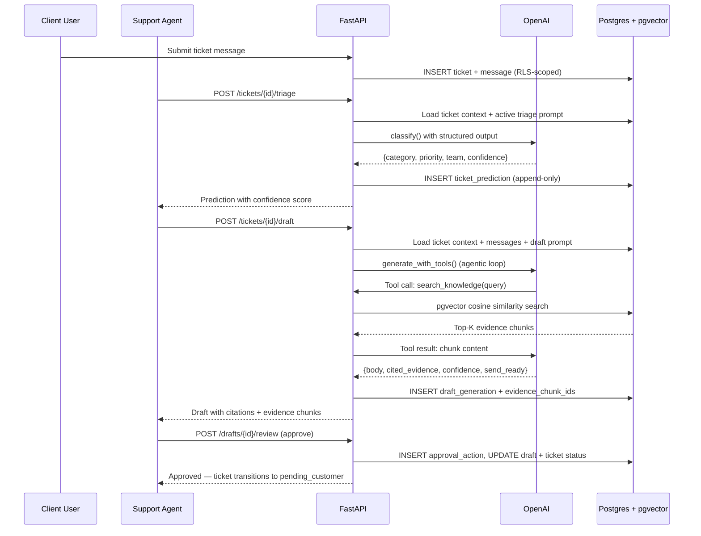

# Architecture

## System Overview

Agent Service Desk is a multi-tenant AI-assisted support system. The architecture follows a clear separation: Next.js handles authentication and serves the UI, FastAPI hosts all business logic and AI pipelines, and Postgres (via Neon) enforces tenant isolation at the database level through Row-Level Security.

```mermaid
graph TD
    subgraph "Frontend (Vercel)"
        Browser[Browser] --> NextJS[Next.js 16<br/>App Router]
        NextJS --> BetterAuth[BetterAuth<br/>Session Management]
        NextJS --> TokenAPI[/api/token<br/>JWT Minting]
    end

    subgraph "Backend (Railway)"
        FastAPI[FastAPI 0.135.x]
        FastAPI --> JWTAuth[JWT Validation<br/>+ Role Extraction]
        JWTAuth --> RLS[RLS Middleware<br/>SET LOCAL ROLE]
        RLS --> Queries[SQL Query Layer]
        FastAPI --> Pipelines[AI Pipelines]
        Pipelines --> OpenAI[OpenAI API<br/>Responses API]
        Pipelines --> Queries
    end

    subgraph "Data Layer"
        Queries --> Neon[(Neon Postgres 16<br/>+ pgvector)]
        FastAPI --> Redis[(Upstash Redis)]
    end

    TokenAPI --> |JWT| FastAPI
    Browser --> |Bearer Token| FastAPI
    BetterAuth --> Neon
```

## Data Flow: Ticket Resolution Loop

The core product loop — from ticket creation through AI-assisted resolution — flows through five stages:



## Background Task Architecture

Long-running operations execute as FastAPI `BackgroundTasks`, avoiding request timeout issues:

| Task | Trigger | What It Does |
|---|---|---|
| Knowledge Ingestion | `POST /knowledge/documents` | Parse file, chunk text (~500 tokens), embed via OpenAI, insert chunks |
| Eval Run Execution | `POST /eval/runs` | Iterate examples, run AI pipeline per example, compute metrics |

Both background tasks use a dedicated connection pattern:

1. The route handler inserts the initial record using its own pool connection (not `get_rls_db`) and commits immediately
2. The background task receives the record ID and opens fresh connections with explicit RLS setup via `SET LOCAL ROLE rls_user`
3. This avoids the Starlette ordering issue where `BackgroundTasks` execute before dependency cleanup commits

## Key Architectural Decisions

### RLS as the Tenant Isolation Layer

All multi-tenant data access goes through Postgres Row-Level Security. The FastAPI dependency `get_rls_db` sets four session variables (`app.org_id`, `app.workspace_id`, `app.user_id`, `app.user_role`) and switches to the `rls_user` role within a transaction. Every query automatically inherits the tenant scope — no application-level filtering needed.

See [Auth & RLS Model](auth-rls.md) for the full RLS policy reference.

### Predictions Are Append-Only

AI triage results are stored in `ticket_predictions` as append-only records. They are never written back to `ticket.category` or `ticket.priority` — those fields change only through explicit agent action. This separation is what makes the evaluation harness meaningful: you can compare model accuracy against human decisions.

### Agentic Drafting with Tool Use

The drafting pipeline uses the OpenAI Responses API with tool calling. The model receives a `search_knowledge` tool and decides when to retrieve evidence. This creates a natural RAG loop: the model formulates search queries based on the ticket context, retrieves relevant knowledge chunks, and generates a grounded response with citations.

See [Retrieval Pipeline](retrieval.md) for details.

### Connection Pool Design

The `psycopg` connection pool uses `open=False` and opens explicitly during FastAPI's lifespan context. This prevents import-time database connection failures and ensures clean startup/shutdown. A `check` callback handles Neon's idle connection drops by validating connections before use.

### SQL Isolation Pattern

All SQL lives in `api/app/queries/` — routers never write SQL directly. Each query module exposes typed functions that accept a connection and return dictionaries (via `dict_row` on the pool). This keeps the router layer thin: validate input, call query function, return Pydantic model.

## Project Structure

```
agent-service-desk/
├── web/                          # Next.js 16 (App Router, TypeScript)
│   ├── src/
│   │   ├── app/
│   │   │   ├── (app)/            # Authenticated route group (sidebar layout)
│   │   │   │   │   ├── overview/      # Operations dashboard (KPIs, charts)
│   │   │   │   ├── tickets/      # Queue + detail workspace
│   │   │   │   ├── reviews/      # Draft approval queue
│   │   │   │   ├── knowledge/    # Document management
│   │   │   │   └── evals/        # Evaluation console
│   │   │   ├── api/              # BetterAuth handler + JWT minting
│   │   │   └── login/            # Auth page
│   │   ├── components/
│   │   │   ├── ticket/           # Ticket workspace panels
│   │   │   ├── eval/             # Eval console components
│   │   │   ├── knowledge/        # Upload dialog
│   │   │   └── ui/               # shadcn/ui primitives
│   │   ├── hooks/                # TanStack Query hooks (data layer)
│   │   ├── lib/                  # api-client, auth, utilities
│   │   └── types/                # TypeScript interfaces mirroring API schemas
│   └── package.json
├── api/                          # FastAPI (Python 3.13)
│   ├── app/
│   │   ├── routers/              # Route handlers (thin controllers)
│   │   │   ├── tickets.py        # CRUD, triage, draft, redraft, stats
│   │   │   ├── knowledge.py      # Docs CRUD, search, upload
│   │   │   ├── drafts.py         # Review queue, approve/reject
│   │   │   ├── evals.py          # Sets, runs, results, comparison
│   │   │   ├── dashboard.py      # Overview KPIs, charts, views, prefs
│   │   │   ├── users.py          # Workspace user list
│   │   │   └── ...               # auth, health, debug, prompts
│   │   ├── queries/              # SQL query functions (data access)
│   │   ├── schemas/              # Pydantic request/response models
│   │   ├── pipelines/            # AI pipeline orchestration
│   │   │   ├── triage.py         # Classification pipeline
│   │   │   ├── drafting.py       # Grounded RAG drafting
│   │   │   ├── retrieval.py      # Semantic search
│   │   │   ├── ingestion.py      # Document chunking + embedding
│   │   │   └── evaluation.py     # Eval runner
│   │   ├── providers/            # OpenAI SDK wrapper
│   │   ├── auth.py               # JWT decode + CurrentUser model
│   │   ├── config.py             # pydantic-settings configuration
│   │   ├── db.py                 # Connection pool management
│   │   ├── deps.py               # FastAPI dependencies (RLS setup)
│   │   └── main.py               # App entry + lifespan
│   └── pyproject.toml
├── seed/                         # Database management scripts
│   ├── schema.sql                # Full schema + RLS policies + indexes
│   ├── seed.py                   # Generate 100 orgs, 15K tickets, etc.
│   ├── demo_accounts.py          # 3 demo users with deterministic data
│   ├── push_schema.py            # Deploy schema (psql-free)
│   ├── reset_db.py               # Drop + recreate all tables
│   ├── verify.py                 # Health check all row counts
│   ├── reembed.py                # Re-embed seed chunks with real vectors
│   ├── migrate_auth.ts           # BetterAuth table creation
│   ├── demo_auth.ts              # Seed demo users into BetterAuth
│   └── mint_tokens.py            # JWT minting for manual testing
├── docs/                         # Specifications and documentation
└── justfile                      # Task runner commands
```
