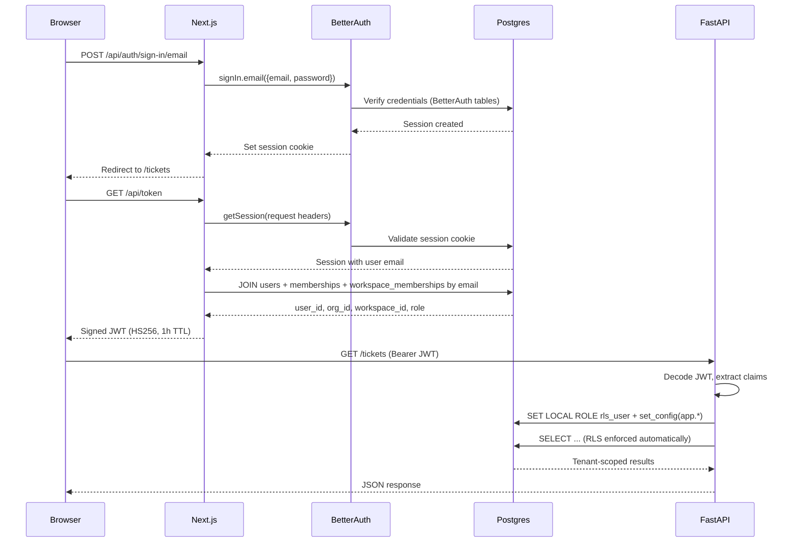

# Auth & RLS Model

## Authentication Flow

Authentication uses a two-system design: BetterAuth manages sessions in the Next.js frontend, and FastAPI validates JWTs for API access.



### Key Points

- **Email as join key**: The `/api/token` endpoint joins BetterAuth's session (keyed by email) to the application's `users` table. No foreign key between the two systems.
- **JWT claims**: `user_id`, `org_id`, `workspace_id`, `role`, `email`, `full_name`
- **Token caching**: The frontend caches JWTs in memory with a 55-minute TTL (5 minutes before expiry) and auto-refreshes transparently.
- **Proxy guard**: Next.js 16's `proxy.ts` checks for cookie presence (`better-auth.session_token` or `__Secure-better-auth.session_token` on HTTPS). It does not validate the session — that happens on the server when `/api/token` is called.

## RLS Execution Model

Every authenticated API request flows through the `get_rls_db` FastAPI dependency, which sets up tenant context before any query executes:

```python
# Simplified from api/app/deps.py
async def get_rls_db(user: CurrentUser):
    with pool.connection() as conn:
        with conn.transaction():
            conn.execute("SET LOCAL ROLE rls_user")
            conn.execute("SELECT set_config('app.org_id', %s, TRUE)", [str(user.org_id)])
            conn.execute("SELECT set_config('app.workspace_id', %s, TRUE)", [str(user.workspace_id)])
            conn.execute("SELECT set_config('app.user_id', %s, TRUE)", [str(user.user_id)])
            conn.execute("SELECT set_config('app.user_role', %s, TRUE)", [str(user.role)])
            yield conn
            # Transaction commits on exit, SET LOCAL resets automatically
```

### Why SET LOCAL?

`SET LOCAL` scopes the role switch and config values to the current transaction. When the transaction ends (commit or rollback), the connection reverts to its original state. This is critical for connection pool safety — the next request that gets this connection will not inherit another tenant's context.

### Helper Functions

Four SQL functions read the session config, used in every RLS policy:

| Function | Returns | Reads |
|---|---|---|
| `current_org_id()` | `UUID` | `app.org_id` |
| `current_workspace_id()` | `UUID` | `app.workspace_id` |
| `current_user_id()` | `UUID` | `app.user_id` |
| `current_user_role()` | `TEXT` | `app.user_role` |

## Access Rules by Role

### client_user

- **Tickets**: Own org's tickets only (`org_id` scope)
- **Messages**: Visible on accessible tickets, but `is_internal = TRUE` messages are hidden
- **Predictions**: Not visible (RLS blocks entirely)
- **Drafts**: Not visible (RLS blocks entirely)
- **Knowledge**: Only `client_visible` documents in the workspace
- **Evals**: Not visible (RLS blocks entirely)
- **UI**: Sees ticket queue, ticket detail (messages + reply only), no triage/draft/evidence panels

### support_agent

- **Tickets**: All tickets in their workspace (`workspace_id` scope)
- **Messages**: All messages including internal notes
- **Predictions**: Visible on accessible tickets
- **Drafts**: Visible on accessible tickets; can generate, approve, reject, escalate
- **Knowledge**: All documents (internal + client_visible) in the workspace; can upload and delete
- **Evals**: Not visible (RLS blocks; application-level 403)
- **UI**: Full ticket workspace with triage/draft/evidence panels, review queue, knowledge page

### team_lead

- **Everything support_agent has**, plus:
- **Evals**: Full access to eval sets, runs, results, and comparisons
- **UI**: Eval console tab visible in navigation

## RLS Policy Reference

| Table | Policy | Logic |
|---|---|---|
| `organizations` | `org_isolation` | `id = current_org_id()` |
| `memberships` | `membership_isolation` | `org_id = current_org_id()` |
| `workspaces` | `workspace_isolation` | `org_id = current_org_id()` |
| `workspace_memberships` | `ws_membership_isolation` | `workspace_id = current_workspace_id()` |
| `tickets` | `ticket_isolation` | client_user: `org_id` scope; agent/lead: `workspace_id` scope |
| `ticket_messages` | `message_isolation` | Parent ticket accessible + client_user excluded from `is_internal` |
| `ticket_assignments` | `assignment_isolation` | Parent ticket accessible |
| `ticket_predictions` | `prediction_isolation` | agent/lead only + parent ticket accessible |
| `knowledge_documents` | `knowledge_doc_isolation` | Workspace scope + client_user limited to `client_visible` |
| `knowledge_chunks` | `knowledge_chunk_isolation` | Parent document accessible |
| `draft_generations` | `draft_isolation` | agent/lead only + parent ticket accessible |
| `approval_actions` | `approval_isolation` | agent/lead only + parent draft accessible |
| `eval_sets/examples/runs/results` | `eval_*_access` | `team_lead` only |
| `dashboard_preferences` | `dashboard_preferences_access` | Own user + own workspace |
| `dashboard_saved_views` | `dashboard_saved_view_access` | Own user + own workspace |

## Tenant Isolation Enforcement

Tenant isolation is enforced at three layers:

1. **Database (RLS)**: Every query runs under `rls_user` with session config. Postgres physically filters rows before they reach the application.
2. **Application (role checks)**: Routes like `/drafts/review-queue` and `/eval/*` call `require_role()` to return 403 before any query runs.
3. **Frontend (role gating)**: Navigation items, panels, and pages check the user's role and hide unauthorized features. API queries use `enabled: false` to prevent firing for unauthorized roles.

This defense-in-depth means that even if a frontend bug exposed a restricted route, the database would still block unauthorized data access.
