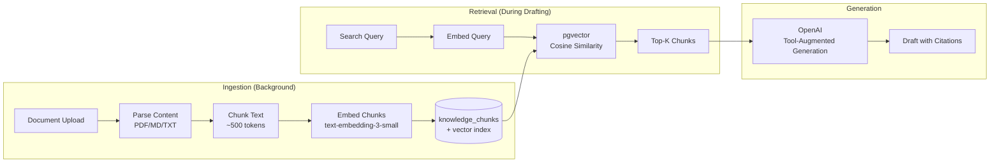

# Retrieval Pipeline

## Overview

Agent Service Desk uses Retrieval-Augmented Generation (RAG) to ground AI-drafted responses in organizational knowledge. The pipeline ensures that every draft response cites specific evidence from the knowledge base, and that citations are traceable back to their source documents.



## Embedding Strategy

| Parameter | Value |
|---|---|
| Model | `text-embedding-3-small` |
| Dimensions | 1536 |
| Distance metric | Cosine similarity (`1 - (a <=> b)`) |
| Index type | HNSW (`vector_cosine_ops`) |
| Batch size | 100 texts per API call |

HNSW (Hierarchical Navigable Small World) is used over IVFFlat for better recall without the need for periodic re-clustering as the knowledge base grows.

## Knowledge Ingestion Flow

When a document is uploaded via `POST /knowledge/documents`:

1. **Record creation**: The route inserts a `knowledge_documents` row with `status = 'pending'` using a dedicated pool connection (not the RLS connection) and commits immediately.

2. **Background task starts**: `ingest_document(document_id, workspace_id)` runs as a `BackgroundTask`.

3. **Retry for visibility**: The task opens a fresh connection and polls for the document row (up to 10 retries at 100ms intervals) to handle the race condition between transaction commit and task execution.

4. **Content parsing**:
   - `.md` / `.txt`: Read as UTF-8 text
   - `.pdf`: Extract text via PyMuPDF (`fitz`)

5. **Chunking**: Text is split into overlapping segments of approximately 500 tokens. The chunker respects paragraph boundaries where possible.

6. **Embedding**: Chunks are embedded in batches of 100 via `embed_batch()`. Each batch is a single OpenAI API call.

7. **Storage**: Chunks with their embeddings are bulk-inserted into `knowledge_chunks` using `cursor.executemany()`.

8. **Status update**: Document status transitions to `indexed` on success, or `failed` on error.

### Status Lifecycle

```
pending → processing → indexed
                     → failed
```

The frontend polls with `refetchInterval` while any document has `status = 'processing'`, and stops polling once all documents are stable.

## Semantic Search

The `search_knowledge()` function in `api/app/pipelines/retrieval.py`:

1. Embeds the query string using `text-embedding-3-small`
2. Runs a pgvector cosine similarity search with HNSW index acceleration
3. Filters by `workspace_id` (belt-and-suspenders alongside RLS) and optionally by `visibility`
4. Returns the top-K results with chunk content, document title, similarity score, and chunk metadata

```sql
SELECT kc.id, kc.document_id, kd.title, kc.content,
       1 - (kc.embedding <=> %s::vector) AS similarity,
       kc.chunk_index
FROM knowledge_chunks kc
JOIN knowledge_documents kd ON kd.id = kc.document_id
WHERE kd.workspace_id = %s
  AND kd.status = 'indexed'
ORDER BY kc.embedding <=> %s::vector
LIMIT %s
```

The `GET /knowledge/search?q=...&top_k=5` endpoint exposes this for direct search. The drafting pipeline also uses it internally via tool calling.

## Agentic Drafting with Citations

The drafting pipeline (`api/app/pipelines/drafting.py`) uses the OpenAI Responses API with tool calling to create a natural retrieval loop:

1. **Context assembly**: The pipeline loads the ticket subject, full message thread, and the active draft prompt.

2. **Tool definition**: A `search_knowledge` tool is defined with parameters for `query` (string) and `top_k` (integer).

3. **Agentic loop**: The model receives the ticket context and decides when to call the search tool. It may call it multiple times with different queries to gather comprehensive evidence.

4. **Evidence accumulation**: All retrieved chunks are collected in a closure-scoped list during the tool-calling rounds.

5. **Response parsing**: The final model output is expected as JSON:
   ```json
   {
     "body": "Draft response text with [chunk:uuid] citation markers",
     "cited_evidence": ["chunk-uuid-1", "chunk-uuid-2"],
     "confidence": 0.85,
     "unresolved_questions": ["Is the customer on the enterprise plan?"],
     "send_ready": true
   }
   ```

6. **Safety enforcement**: If `cited_evidence` is empty after parsing, `send_ready` is forced to `false` regardless of what the model returned. This is a hard invariant — drafts without evidence always require human review.

7. **Storage**: The draft is stored in `draft_generations` with `evidence_chunk_ids` (UUID array) pointing to the actual chunks used.

## Citation Traceability

Every draft maintains a chain of evidence:

```
draft_generations.evidence_chunk_ids[]
  → knowledge_chunks.id
    → knowledge_chunks.document_id
      → knowledge_documents.id (title, source_filename)
```

The ticket workspace UI shows:
- The **draft body** with citation markers
- An **evidence panel** listing the retrieved chunks with their source document titles and similarity scores
- **Confidence badge** indicating the model's self-assessed confidence

This traceability allows support agents to verify that the AI's response is grounded in actual organizational knowledge before approving it.

## Mock Mode

Setting `MOCK_AI=1` activates mock implementations in the OpenAI provider:

- `_mock_embed_batch()`: Returns deterministic vectors (not random) for consistent testing
- `_mock_generate_with_tools()`: Calls the real tool executor (so actual DB retrieval runs) but skips the LLM generation step

This allows testing the full pipeline — retrieval, RLS scoping, DB writes, and status transitions — without spending OpenAI API credits.
